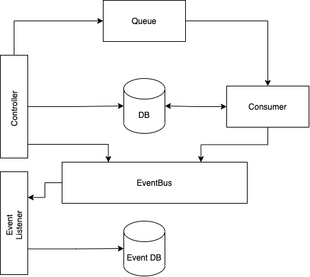

# Sms
#### Smartech task

---

سعی کردم که همه تلاشم رو بکنم تا کد خودش گویا باشه. ولی یکم توضیح می‌دم.

کلا این طوری کار میکنه که یک rest-api وجود داره که به درخواست ارسال sms به اون ارسال میشه.

این درخواست ارسال به صورت یه تسک در میاد و داخل یک Queue ذخیره میشه (کاری به ابزاری که این Queue رو باهاش درست می‌کنیم ندارم)
یه (یا چنتا) Consumer وجود داره که به این Queue گوش می‌ده و تسک‌ها رو از تویه Queue برمی‌داره.
و تلاش می‌کنه تا پیام رو ارسال کنه. اگر موفق نشه و هیچ کدوم از Provider ها کار نکنه تسک رو می‌فرسته روی یه Queue دیگه که اونجا در مورد تلاش دوباره برای ارسال پیام تصمیم گرفته میشه.

تویه تمام مراحل Log داریم که روی console نوشته میشه. و البته برای هر تغییر یک Event متناظر وجود داره که روی یک EventBus منتشر میشه. این Event ها درواقع وضعیت هر پبام رو نشون میده و کمک میکنه تا هر پیام رو ره‌گیری کنیم.

---

سه‌تا لایه کلی داریم:

1. domain (sms-domain)
2. application (sms-app)
3. infrastructure (sms-infra)

---
### Domain :

همه لاجیک برنامه اینجاست. همین طور همه مدل ها. repository ها هم برای دسترسی به database تویه این قسمت به صورت interface تعریف شدن.

این لایه به هیچ لایه دیگه‌ای دسترسی نداره. همین طور به تا حد امکان به هیچ به library خارجی هم وابسته نیست (البته بعضی چیزا لازمه و ضرری هم نداره). اصلا چیزی از HTTP یا Database توی این لایه نیست.

### Application :

نقش ورودی رو داره. تمام ورودی‌هایی که به سامانه وارد میشه از این نقطه هست.

این لایه به Domain دسترسی داره و نقش رهبر ارکست رو داره که کاراهای Domain رو نظم میده و از اونا به شکل درستش استفاده میکنه.

### Infrastructure :

تمام ریزساختی که نیاز داریم تویه این لایه پیاده‌سازی میشه، مثل Database.

 در واقع این لایه‌ای هست که با دنیای بیرون از سیستم در ارتباط است.همچنین وجود این لایه باعث میشه که وابستگی کا سامانه به ابزار‌های بیرونی کم بشه و بتونیم به راحتی از ابزار‌های مختلف استفاده کنیم.
مثلا ORM رو عوض کنیم.

این لایه به Domain و Application دسترسی داره.

